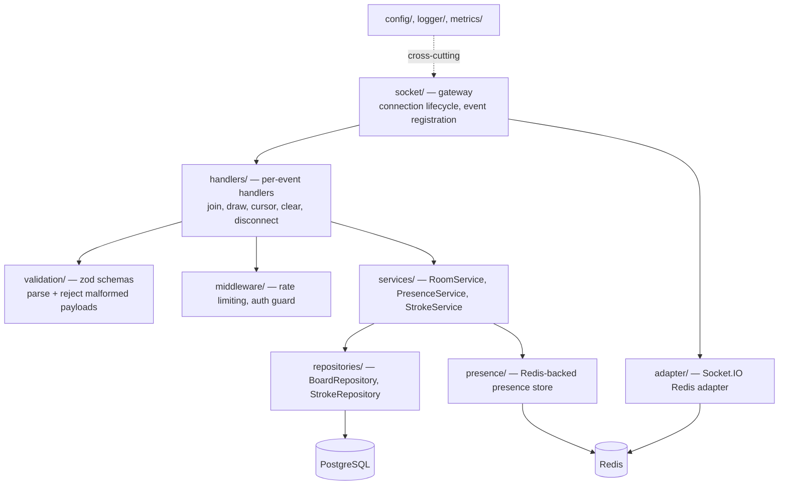
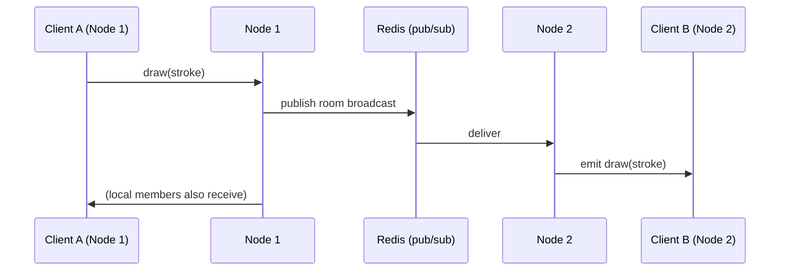

# Design Document: Production Readiness — Synapse Collaborative Whiteboard

## Overview

Synapse is a real-time collaborative whiteboard (Vite + React 19 + TypeScript client, Express 5 + Socket.IO 4 server). Today it is a working prototype: drawing, live cursors, presence, and an infinite pan/zoom canvas all function, but everything lives in server process memory, there is no authentication or input validation, no tests, no persistence, no deployment pipeline, and the UI styling is ad-hoc inline styles rather than a documented design system.

This design takes Synapse from prototype to a production-grade, market-ready product across three pillars the user asked for: (1) professional, accessible, design-system-driven UI/UX, (2) senior-level engineering quality (strict typing, validated socket contracts, modular architecture, tested, secure), and (3) market-ready deployment (containerization, CI/CD, hosting, environment config, observability). It is deliberately incremental: the existing architecture is preserved and hardened rather than rewritten, so each phase ships independently and the product stays shippable throughout.

The document is organized as High-Level Design first (architecture, scaling/persistence, security model, real-time protocol, UI/UX design system, data models) followed by Low-Level Design (TypeScript interfaces, validated socket event schemas, persistence access patterns, and pseudocode for the critical algorithms: stroke pruning/compaction, reconnection resync, and rate limiting). Where there is a real product decision (authentication model, persistence backend), the recommended option is called out with alternatives.

---

## Goals and Non-Goals

### Goals
- Persist stroke history so a server restart or redeploy does not lose board content.
- Allow horizontal scaling of the Socket.IO layer (multiple server instances behind a load balancer).
- Validate every inbound socket payload against a schema; reject malformed input.
- Rate-limit high-frequency events (`draw`, `cursor-move`) to remove the unbounded-push DoS vector.
- Bound per-room memory and stored history via pruning/compaction.
- Add a documented, accessible, responsive design system and refactor UI to use it.
- Add automated tests (unit, property-based, integration) and CI gates.
- Containerize and define a one-command deploy with environment-based config and observability.

### Non-Goals (this iteration)
- Full multi-tenant user accounts with billing. (Optional accounts are designed for but auth model defaults to anonymous-shareable; see Security Model.)
- Operational Transform / CRDT conflict resolution. Strokes are append-only and commutative, so last-writer-wins per stroke is acceptable; richer object editing (move/edit existing shapes) is out of scope.
- New drawing primitives (text, shapes). The data model is designed to be extensible to them, but they are not implemented here.

---

## Architecture

### Current State (as built)

```mermaid
graph TD
    B1[Browser Tab 1] -- WebSocket --> S[Single Express + Socket.IO process]
    B2[Browser Tab 2] -- WebSocket --> S
    S --> MEM[("In-memory Map&lt;roomId, RoomData&gt;<br/>strokes / users / cleanupTimer")]
    style MEM fill:#3a1a1a,stroke:#a33
```



Single process, single source of truth in RAM. Restart = total data loss. Cannot run a second instance because each would hold a disjoint view of rooms.

### Target State (production)

```mermaid
graph TD
    subgraph Client
      U[React 19 SPA<br/>Vite build → static assets]
    end

    U -- HTTPS / WSS --> LB[Load Balancer / Ingress<br/>TLS termination, sticky sessions]

    LB --> N1[Synapse Node 1]
    LB --> N2[Synapse Node 2]
    LB --> N3[Synapse Node N...]

    subgraph App Tier - stateless
      N1
      N2
      N3
    end

    N1 -- pub/sub fan-out --> R[(Redis<br/>Socket.IO adapter + presence)]
    N2 -- pub/sub fan-out --> R
    N3 -- pub/sub fan-out --> R

    N1 -- read/write strokes --> DB[(PostgreSQL<br/>durable board + stroke store)]
    N2 --> DB
    N3 --> DB

    N1 -. metrics/logs/traces .-> O[Observability<br/>structured logs + /metrics + health]
    N2 -.-> O
    N3 -.-> O

    style R fill:#1a2a3a,stroke:#39a
    style DB fill:#1a3a2a,stroke:#3a9
```



Key changes:
- **App tier becomes stateless.** Room membership and pub/sub fan-out move to the Redis Socket.IO adapter, so any node can serve any client and broadcasts reach all nodes.
- **Strokes persist to PostgreSQL**, written through a repository layer with a write-behind buffer (batched inserts) to absorb draw throughput. History on join is loaded from the DB (with an in-memory/Redis hot cache).
- **Presence (live users, cursor colors)** lives in Redis keyed by room, so presence is consistent across nodes and survives a single node restart.
- **Static client** is built to static assets and served by a CDN / static host, fully decoupled from the API tier.

### Module Decomposition (server)

The current single `server/index.ts` is split into a layered, testable structure. Each layer has one responsibility and depends only downward.



Proposed server source layout:

```
server/src/
├── index.ts                 # composition root: build config, wire deps, start
├── app.ts                   # express app (health, metrics, CORS) — exported for tests
├── socket/
│   ├── gateway.ts           # io setup, adapter, connection handler, registration
│   └── context.ts           # per-connection context (auth, room, rate limiters)
├── handlers/
│   ├── joinRoom.ts
│   ├── draw.ts
│   ├── cursorMove.ts
│   ├── clear.ts
│   └── disconnecting.ts
├── validation/
│   └── schemas.ts           # zod schemas + inferred types (single source of truth)
├── middleware/
│   ├── rateLimiter.ts       # token-bucket per socket per event
│   └── authGuard.ts         # verifies join token / room password
├── services/
│   ├── roomService.ts
│   ├── strokeService.ts     # pruning/compaction, write-behind buffer
│   └── presenceService.ts
├── repositories/
│   ├── boardRepository.ts
│   └── strokeRepository.ts
├── persistence/
│   ├── db.ts                # pg pool
│   └── redis.ts             # redis client(s)
├── config/
│   └── env.ts               # zod-validated environment config
├── observability/
│   ├── logger.ts            # pino structured logger
│   └── metrics.ts           # prom-client registry
└── types/
    └── domain.ts            # shared domain types
```

Client structure is reorganized around a design system and feature folders (see UI/UX section).

---

## Persistence Strategy

### Decision: PostgreSQL for durable history + Redis for presence/pub-sub

**Recommended:** PostgreSQL as the durable store for boards and strokes, Redis for the Socket.IO adapter and ephemeral presence.

Rationale:
- Strokes are an append-heavy, ordered log per board. A relational table with a `(board_id, seq)` index gives ordered reads for history replay and cheap range pruning. Postgres is operationally well understood, has managed offerings everywhere (RDS, Cloud SQL, Neon, Supabase), and `jsonb` lets us store the stroke payload flexibly while keeping it queryable.
- Redis is the natural fit for the Socket.IO adapter (it is the officially supported adapter) and for presence, which is ephemeral, high-churn, and benefits from TTL expiry.

**Alternatives considered:**
- **Redis-only (persistence + presence).** Simpler infra (one system). Redis can persist via AOF/RDB, and strokes could live in a Redis list per room. Downside: durability guarantees are weaker than Postgres, large per-board lists strain memory cost, and ad-hoc querying/retention is awkward. Good fallback if the team wants a single datastore and accepts the durability trade-off.
- **MongoDB.** A document per stroke or per board fits the schema-light payload. Reasonable, but adds a datastore the team would also need for nothing Postgres can't do here. Not recommended unless already in the stack.
- **SQLite + Litestream.** Great for a single small deployment, but blocks the horizontal-scaling goal. Rejected for the market-ready target.

### Write path (write-behind buffering)

Draw events arrive at high frequency (one per mouse-move segment). Writing each stroke synchronously to Postgres would create per-event latency and connection pressure. Instead, `StrokeService` buffers strokes per room in memory and flushes in batches (size- or time-triggered) using a single multi-row insert. The broadcast to other clients happens immediately (low latency for collaborators); durability lags by at most the flush interval. On graceful shutdown the buffer is flushed.

```mermaid
sequenceDiagram
    participant C as Client
    participant N as Node (StrokeService)
    participant Redis as Redis adapter
    participant DB as PostgreSQL

    C->>N: draw(stroke) [validated, rate-limited]
    N->>Redis: broadcast draw → room (all nodes)
    N->>N: buffer.push(stroke); seq assigned
    alt buffer full OR flush timer fires
        N->>DB: INSERT batch (multi-row)
        DB-->>N: ack
    end
```

### Read path (history on join)

On `join-room`, the joining client needs current board state. To avoid replaying potentially huge stroke logs, history is served from a snapshot + tail model:

- Periodically (or when stroke count crosses a threshold) the server **compacts** a board: it records a `snapshot_seq` and treats all strokes up to it as the baseline. Pruning can drop strokes older than the snapshot if a rasterized snapshot image is stored, or simply cap retained strokes.
- On join: read the latest snapshot (if any) plus strokes with `seq > snapshot_seq`. A hot board keeps this tail in a Redis/in-memory cache to avoid a DB round-trip on every join.

---

## Scaling Strategy

### Horizontal scaling via the Socket.IO Redis adapter

The blocker to running more than one node is that `socket.to(roomId).emit(...)` only reaches sockets connected to the same process. The [Socket.IO Redis adapter] solves this by publishing every room broadcast to Redis so all nodes deliver it to their local room members.



Operational notes:
- **Sticky sessions** are required at the load balancer when HTTP long-polling is enabled, because the polling handshake must return to the same node. If transport is forced to WebSocket-only, stickiness is not strictly required, but enabling it is the safer default. This is a config/infra requirement, documented in deployment.
- **Presence** is not handled by the adapter; it is application state. `PresenceService` stores `room:{id}:users` in Redis (hash of socketId → user), with cursor color assignment coordinated through Redis so colors stay unique across nodes. Presence entries carry a TTL and are refreshed on activity, so a crashed node's stale users expire instead of lingering forever.

---

## Security Model

The current server trusts every payload, has no authentication, no validation, no rate limiting, and a single hardcoded CORS origin. The production model addresses each.

### Decision: Anonymous-but-shareable by default, with optional room passwords

**Recommended:** Keep the zero-friction "create a board, share the link" flow as the default, but make rooms unguessable and add **optional room passwords** plus short-lived **join tokens**.

How it works:
- A board ID stays a `nanoid` (≈10 chars). Knowledge of the link is the baseline capability ("capability URL"), as today — but we stop treating the raw room ID as a socket credential.
- When a client wants to join, it first calls a small HTTP endpoint `POST /api/rooms/:id/join` with an optional password. The server validates the password (if the room is protected) and returns a **signed, short-lived JWT join token** scoped to that room.
- The socket connection presents the token in the handshake (`auth.token`). An `authGuard` verifies it before any room event is processed. No valid token → no join.

This gives us: validated membership, the ability to protect sensitive boards, and a clean upgrade path to real accounts later (the token issuer can later require login) — all without forcing sign-up for casual use.

**Alternatives considered:**
- **Fully open (status quo).** Lowest friction, zero security. Rejected for "market-ready," kept only as an explicit `OPEN_MODE` config for demos.
- **Mandatory accounts (email/OAuth).** Strongest identity, enables ownership/sharing controls and history-per-user. Higher friction and more scope (user store, auth provider). Designed-for (the join-token issuer is the seam) but not the default this iteration.

### Defense layers (apply regardless of auth model)

| Threat | Current gap | Mitigation |
|---|---|---|
| Malformed/malicious payloads | No validation | Zod schema parse on every event; reject + structured-log on failure |
| Event flooding / DoS | Unbounded `draw`/`cursor` push | Token-bucket rate limiter per socket per event type |
| Unbounded memory growth | Strokes array grows forever | Per-room stroke cap + compaction/pruning |
| Oversized payloads | No size checks | `maxHttpBufferSize` cap on Socket.IO + per-stroke point/coord bounds in schema |
| Cross-origin abuse | Single hardcoded origin | Allowlist of origins from validated env config; reject others |
| Token theft / replay | N/A (no tokens) | Short TTL join tokens, room-scoped, signed; WSS only in prod |
| Secret leakage | Hardcoded URLs | All secrets/URLs via validated env; never committed |

> Security note: any network-exposed endpoint without auth is a risk. The default model authenticates the socket via join token before processing room events; the only unauthenticated endpoints are the health check, metrics (which should be network-restricted to the monitoring scrape target, not public), and the token-issuing join endpoint (which itself enforces room passwords and is rate-limited).

---

## Real-time Protocol (hardened)

The event names are kept compatible with the current client/server where possible to minimize churn, but every payload is now schema-defined and versioned. A `protocolVersion` is included on connect so future changes can be negotiated.

### Client → Server

| Event | Payload (validated) | Notes |
|---|---|---|
| `join-room` | `{ roomId, username, token }` | `token` = signed join token; server verifies before join |
| `draw` | `{ roomId, stroke }` | rate-limited; stroke fields bounded; `seq` assigned server-side |
| `cursor-move` | `{ roomId, x, y }` | volatile, rate-limited; not persisted |
| `clear` | `{ roomId }` | authorized; persisted as a clear marker |
| `undo` *(new, optional)* | `{ roomId }` | removes the requesting user's last stroke group |

### Server → Client

| Event | Payload | Notes |
|---|---|---|
| `your-color` | `string` | assigned cursor color (coordinated via Redis) |
| `room-history` | `{ snapshot?, strokes }` | snapshot + tail model |
| `draw` | `stroke` | remote stroke (now carries `seq`, `id`, `userId`) |
| `cursor-update` | `{ socketId, x, y }` | remote cursor |
| `users-update` | `User[]` | presence list |
| `clear` | — | clear canvas |
| `error` *(new)* | `{ code, message }` | validation/auth/rate-limit rejections |
| `sync-required` *(new)* | `{ sinceSeq }` | server asks client to resync after gap |

---

## Data Models

### Domain types (shared, server `types/domain.ts`)

The existing client uses a **segment-based** stroke (`x0,y0 → x1,y1`), which the server stores as-is. We keep that wire shape for backward compatibility but enrich it with identity and ordering metadata that the server controls.

```typescript
/** A single drawn segment in world-space coordinates. */
export interface StrokeSegment {
  x0: number;
  y0: number;
  x1: number;
  y1: number;
  color: string;   // CSS color; validated against a safe pattern
  width: number;   // world-space width; bounded > 0
}

/** Server-enriched stroke as persisted and broadcast. */
export interface PersistedStroke extends StrokeSegment {
  id: string;          // server-generated (nanoid)
  seq: number;         // monotonic per-board ordering key
  userId: string;      // author (socket/user id)
  ts: number;          // server receive time (epoch ms)
}

export interface User {
  socketId: string;
  userId: string;      // stable per join (from token), distinct from socketId
  username: string;
  cursorColor: string;
  cursor: { x: number; y: number } | null;
}

export interface BoardSnapshot {
  boardId: string;
  snapshotSeq: number;     // strokes up to this seq are baked into the snapshot
  imageUrl?: string;       // optional rasterized baseline (object storage)
  createdAt: number;
}
```

### Validation rules (enforced by schema, see Low-Level Design)
- `username`: 1–20 chars after trim, no control characters.
- `roomId`: matches `^[A-Za-z0-9_-]{6,32}$` (nanoid alphabet).
- `color`: matches a safe CSS color allowlist pattern (hex, `rgb()`, `rgba()`); rejects arbitrary strings.
- `width`: finite number, `0 < width <= 200`.
- coordinates `x0,y0,x1,y1,x,y`: finite numbers within `[-1e6, 1e6]` (sane world bounds; rejects `NaN`/`Infinity`).

### Database schema (PostgreSQL)

```sql
CREATE TABLE boards (
  id            TEXT PRIMARY KEY,
  created_at    TIMESTAMPTZ NOT NULL DEFAULT now(),
  last_activity TIMESTAMPTZ NOT NULL DEFAULT now(),
  password_hash TEXT,                 -- nullable: null = unprotected room
  snapshot_seq  BIGINT NOT NULL DEFAULT 0,
  snapshot_url  TEXT
);

CREATE TABLE strokes (
  board_id  TEXT   NOT NULL REFERENCES boards(id) ON DELETE CASCADE,
  seq       BIGINT NOT NULL,          -- monotonic per board
  id        TEXT   NOT NULL,
  user_id   TEXT   NOT NULL,
  payload   JSONB  NOT NULL,          -- StrokeSegment
  ts        TIMESTAMPTZ NOT NULL DEFAULT now(),
  PRIMARY KEY (board_id, seq)
);

CREATE INDEX idx_strokes_board_seq ON strokes (board_id, seq);
```

### Redis keyspace

| Key | Type | Purpose | TTL |
|---|---|---|---|
| `room:{id}:users` | hash (socketId → JSON User) | presence list | refreshed; expires when empty |
| `room:{id}:colors` | set | cursor colors in use | tied to presence |
| `room:{id}:seq` | string (counter) | monotonic stroke seq allocator | board lifetime |
| `room:{id}:tail` | list (capped) | hot cache of recent strokes for fast join | board lifetime |
| Socket.IO adapter keys | — | pub/sub fan-out (managed by adapter) | — |

---

## Components and Interfaces

This section is the entry point to the Low-Level Design: validated configuration, schema-defined socket contracts, and the service interfaces that the handlers depend on.

### Configuration (validated env)

```typescript
// config/env.ts
import { z } from "zod";

const EnvSchema = z.object({
  NODE_ENV: z.enum(["development", "test", "production"]).default("development"),
  PORT: z.coerce.number().int().positive().default(3001),
  CLIENT_ORIGINS: z.string().transform((s) => s.split(",").map((o) => o.trim())),
  DATABASE_URL: z.string().url(),
  REDIS_URL: z.string().url(),
  JWT_SECRET: z.string().min(32),
  OPEN_MODE: z.coerce.boolean().default(false),     // bypass auth for demos
  STROKE_CAP: z.coerce.number().int().positive().default(50_000),
  FLUSH_INTERVAL_MS: z.coerce.number().int().positive().default(1_000),
  FLUSH_BATCH_SIZE: z.coerce.number().int().positive().default(200),
  LOG_LEVEL: z.enum(["debug", "info", "warn", "error"]).default("info"),
});

export type Env = z.infer<typeof EnvSchema>;

/** Fail fast at boot if config is invalid. */
export function loadEnv(raw: NodeJS.ProcessEnv): Env {
  const parsed = EnvSchema.safeParse(raw);
  if (!parsed.success) {
    // log the flattened error and exit non-zero; never start misconfigured
    throw new Error(`Invalid environment: ${parsed.error.toString()}`);
  }
  return parsed.data;
}
```

### Socket event schemas (single source of truth)

```typescript
// validation/schemas.ts
import { z } from "zod";

const finiteCoord = z.number().finite().min(-1e6).max(1e6);
const safeColor = z.string().regex(
  /^(#[0-9a-fA-F]{3,8}|rgba?\(\s*\d{1,3}(\s*,\s*\d{1,3}){2}(\s*,\s*(0|1|0?\.\d+))?\s*\))$/
);

export const StrokeSegmentSchema = z.object({
  x0: finiteCoord, y0: finiteCoord,
  x1: finiteCoord, y1: finiteCoord,
  color: safeColor,
  width: z.number().finite().gt(0).max(200),
}).strict();

export const JoinRoomSchema = z.object({
  roomId: z.string().regex(/^[A-Za-z0-9_-]{6,32}$/),
  username: z.string().trim().min(1).max(20).regex(/^[^\u0000-\u001F]+$/),
  token: z.string().min(1),
}).strict();

export const DrawSchema = z.object({
  roomId: z.string().regex(/^[A-Za-z0-9_-]{6,32}$/),
  stroke: StrokeSegmentSchema,
}).strict();

export const CursorMoveSchema = z.object({
  roomId: z.string().regex(/^[A-Za-z0-9_-]{6,32}$/),
  x: finiteCoord, y: finiteCoord,
}).strict();

export const ClearSchema = z.object({
  roomId: z.string().regex(/^[A-Za-z0-9_-]{6,32}$/),
}).strict();

// Inferred types are reused across handlers — schema and type never drift.
export type JoinRoomInput = z.infer<typeof JoinRoomSchema>;
export type DrawInput = z.infer<typeof DrawSchema>;
export type CursorMoveInput = z.infer<typeof CursorMoveSchema>;
```

### Service interfaces

```typescript
// services interfaces (constructor-injected; mockable in tests)

export interface StrokeRepository {
  insertBatch(boardId: string, strokes: PersistedStroke[]): Promise<void>;
  loadSince(boardId: string, sinceSeq: number): Promise<PersistedStroke[]>;
  deleteThrough(boardId: string, throughSeq: number): Promise<void>;
  count(boardId: string): Promise<number>;
}

export interface BoardRepository {
  ensure(boardId: string): Promise<void>;
  getSnapshotSeq(boardId: string): Promise<number>;
  setSnapshot(boardId: string, seq: number, url?: string): Promise<void>;
  getPasswordHash(boardId: string): Promise<string | null>;
  touch(boardId: string): Promise<void>;
}

export interface PresenceService {
  join(boardId: string, user: User): Promise<User[]>;
  leave(boardId: string, socketId: string): Promise<User[]>;
  updateCursor(boardId: string, socketId: string, x: number, y: number): Promise<void>;
  list(boardId: string): Promise<User[]>;
  allocateColor(boardId: string): Promise<string>;   // atomic across nodes
}

export interface StrokeService {
  /** Buffer + assign seq + schedule flush. Returns the enriched stroke to broadcast. */
  append(boardId: string, userId: string, seg: StrokeSegment): Promise<PersistedStroke>;
  /** Snapshot + tail for late joiners. */
  loadForJoin(boardId: string): Promise<{ snapshot?: BoardSnapshot; strokes: PersistedStroke[] }>;
  /** Enforce cap; compact/prune when exceeded. */
  maybeCompact(boardId: string): Promise<void>;
  clear(boardId: string): Promise<void>;
  flush(boardId: string): Promise<void>;   // force-flush buffer (graceful shutdown)
}

export interface RateLimiter {
  /** true = allowed, false = rejected (bucket empty). */
  tryConsume(key: string, cost?: number): boolean;
}
```

---

## Key Functions with Formal Specifications

### `StrokeService.append`

```typescript
append(boardId: string, userId: string, seg: StrokeSegment): Promise<PersistedStroke>
```

**Preconditions:**
- `seg` has already passed `StrokeSegmentSchema` validation (handler responsibility).
- `boardId` matches the room the socket is authorized for.

**Postconditions:**
- Returns a `PersistedStroke` whose `seq` is strictly greater than every previously appended stroke's `seq` for `boardId` (monotonic ordering).
- The stroke is present in the in-memory write buffer for `boardId`.
- The stroke will be durably persisted within at most `FLUSH_INTERVAL_MS` (or sooner if the batch fills), unless the process is killed non-gracefully.
- No mutation of the input `seg` object.

**Loop invariants:** N/A (no loops).

### `StrokeService.maybeCompact`

```typescript
maybeCompact(boardId: string): Promise<void>
```

**Preconditions:**
- `boardId` exists.

**Postconditions:**
- If retained stroke count `<= STROKE_CAP`, no change.
- If `> STROKE_CAP`, the board's `snapshot_seq` advances to a chosen cut point, strokes with `seq <= snapshot_seq` may be deleted (after the snapshot baseline is recorded), and the retained count returns to `<= STROKE_CAP`.
- Board visual state for any future joiner is unchanged (snapshot + remaining tail reproduces the same canvas).

**Loop invariants:** during batched deletion, all strokes with `seq > snapshot_seq` remain present and ordered.

### `authGuard`

```typescript
authGuard(token: string, roomId: string): { ok: true; userId: string } | { ok: false; code: string }
```

**Preconditions:** `roomId` is a valid room id string.

**Postconditions:**
- Returns `ok: true` with a stable `userId` iff `token` is a signature-valid, unexpired join token scoped to `roomId` (or `OPEN_MODE` is enabled).
- Returns `ok: false` with a machine-readable `code` otherwise. No exception thrown for ordinary auth failure (failures are expected control flow).
- No side effects.

---

## Algorithmic Pseudocode

### Stroke pruning / compaction

```pascal
ALGORITHM maybeCompact(boardId)
INPUT:  boardId
OUTPUT: none (side effect: bounded storage)

BEGIN
  total ← strokeRepository.count(boardId)

  IF total <= STROKE_CAP THEN
    RETURN                                  // nothing to do
  END IF

  // Keep the most recent KEEP_TAIL strokes live; bake the rest into a snapshot.
  KEEP_TAIL ← STROKE_CAP / 2                 // hysteresis: avoid compacting every stroke
  cutSeq ← seqOfNthMostRecentStroke(boardId, KEEP_TAIL)

  // 1. Produce a baseline snapshot covering strokes seq <= cutSeq.
  //    Either rasterize to an image (preferred for huge boards) or record cutSeq only.
  snapshotUrl ← renderSnapshotImage(boardId, upTo: cutSeq)   // optional, may be null
  boardRepository.setSnapshot(boardId, cutSeq, snapshotUrl)

  ASSERT boardRepository.getSnapshotSeq(boardId) = cutSeq

  // 2. Delete now-redundant strokes in bounded batches to avoid long locks.
  WHILE strokeRepository.count(boardId) > KEEP_TAIL DO
    ASSERT every retained stroke has seq > (cutSeq - retainedSoFar)  // ordering preserved
    strokeRepository.deleteThrough(boardId, cutSeq, batchSize: 1000)
  END WHILE

  // 3. Refresh hot tail cache.
  rebuildRedisTail(boardId)

  ASSERT strokeRepository.count(boardId) <= STROKE_CAP
END
```

**Preconditions:** `boardId` exists; `STROKE_CAP > 0`.
**Postconditions:** retained strokes `<= STROKE_CAP`; snapshot + tail reproduces identical canvas.
**Loop invariants:** strokes with `seq > cutSeq` are never deleted and remain ordered.

### Reconnection / state resync

The client tracks the highest `seq` it has applied. On reconnect (or when the server sends `sync-required`), it requests only the delta rather than the full history, and the server replays the gap or, if the gap predates the snapshot, sends a full reload.

```pascal
ALGORITHM onClientReconnect(socket, boardId, lastAppliedSeq)
INPUT:  socket, boardId, lastAppliedSeq (highest seq client has rendered)
OUTPUT: client canvas is consistent with server

BEGIN
  snapshotSeq ← boardRepository.getSnapshotSeq(boardId)

  IF lastAppliedSeq < snapshotSeq THEN
    // Client is too far behind; its old strokes may have been compacted away.
    // Send full baseline + tail (authoritative reload).
    payload ← strokeService.loadForJoin(boardId)
    socket.emit("room-history", payload)        // includes snapshot + strokes
    clientResetCanvasTo(payload)
  ELSE
    // Client only missed a tail; send just the delta.
    missing ← strokeRepository.loadSince(boardId, lastAppliedSeq)
    FOR each stroke IN missing (ordered by seq ASC) DO
      ASSERT stroke.seq > lastAppliedSeq         // monotonic, no duplicates
      socket.emit("draw", stroke)
      lastAppliedSeq ← stroke.seq
    END FOR
  END IF

  ASSERT clientHighestSeq(socket) = serverHighestSeq(boardId)   // converged
END
```

**Preconditions:** `lastAppliedSeq >= 0`; board exists.
**Postconditions:** client's applied seq equals server's highest seq (canvases converge); no stroke applied twice.
**Loop invariants:** before each iteration, all strokes with seq in `(prevLastApplied, current)` have been emitted in ascending order.

Client-side gap detection (so the client knows to ask):

```pascal
ALGORITHM onRemoteDraw(stroke)
BEGIN
  IF stroke.seq = lastAppliedSeq + 1 THEN
    applyStroke(stroke)
    lastAppliedSeq ← stroke.seq
  ELSE IF stroke.seq <= lastAppliedSeq THEN
    IGNORE                                  // duplicate / already applied
  ELSE
    // gap detected: a stroke is missing between lastAppliedSeq and stroke.seq
    bufferOutOfOrder(stroke)
    requestResync(boardId, lastAppliedSeq)  // triggers onClientReconnect path
  END IF
END
```

### Rate limiting (token bucket per socket per event)

```pascal
ALGORITHM tryConsume(bucket, now, cost)
INPUT:  bucket {tokens, lastRefill, capacity, refillPerSec}, now, cost
OUTPUT: allowed (boolean)

BEGIN
  elapsed ← (now - bucket.lastRefill) / 1000
  bucket.tokens ← MIN(bucket.capacity, bucket.tokens + elapsed * bucket.refillPerSec)
  bucket.lastRefill ← now

  IF bucket.tokens >= cost THEN
    bucket.tokens ← bucket.tokens - cost
    RETURN true
  ELSE
    RETURN false                            // caller drops event, emits "error" sparingly
  END IF
END
```

**Preconditions:** `cost > 0`; `capacity > 0`; `refillPerSec > 0`.
**Postconditions:** returns true at most `capacity` times within any window before refill catches up; `tokens` never exceeds `capacity` nor drops below 0.
Applied with generous limits for `draw` (e.g. capacity 120, refill 120/s) and `cursor-move` (e.g. capacity 60, refill 60/s) so normal drawing is unaffected but floods are capped.

---

## Example Usage

### Server composition root

```typescript
// index.ts
const env = loadEnv(process.env);
const logger = createLogger(env);
const db = createPool(env.DATABASE_URL);
const redis = createRedis(env.REDIS_URL);

const boards = new PgBoardRepository(db);
const strokes = new PgStrokeRepository(db);
const presence = new RedisPresenceService(redis);
const strokeService = new BufferedStrokeService(strokes, boards, env, logger);

const app = createApp({ env, logger });            // health, metrics, /api/rooms join
const server = http.createServer(app);
const io = createGateway(server, { env, redis, presence, strokeService, boards, logger });

await waitForDependencies({ db, redis });          // readiness
server.listen(env.PORT, () => logger.info({ port: env.PORT }, "Synapse up"));

registerGracefulShutdown(async () => {
  await strokeService.flushAll();                  // no data loss on deploy
  await io.close(); await db.end(); await redis.quit();
});
```

### Draw handler (validated + rate-limited + persisted)

```typescript
// handlers/draw.ts
export function makeDrawHandler(ctx: ConnectionContext, deps: Deps) {
  return async (raw: unknown) => {
    if (!ctx.limiter.tryConsume(`draw:${ctx.socket.id}`)) return;          // rate limit

    const parsed = DrawSchema.safeParse(raw);                             // validation
    if (!parsed.success) {
      deps.logger.warn({ socketId: ctx.socket.id }, "invalid draw payload");
      ctx.socket.emit("error", { code: "INVALID_PAYLOAD", message: "draw rejected" });
      return;
    }

    const { roomId, stroke } = parsed.data;
    if (roomId !== ctx.roomId) return;                                    // authz: own room only

    const persisted = await deps.strokeService.append(roomId, ctx.userId, stroke);
    ctx.socket.to(roomId).emit("draw", persisted);                        // broadcast (via adapter)
    deps.metrics.strokesTotal.inc();
    await deps.strokeService.maybeCompact(roomId);                        // bounded memory
  };
}
```

### Client: applying ordered strokes with gap detection

```typescript
// client useSocket addition
const lastSeq = useRef(0);

socket.on("draw", (stroke: PersistedStroke) => {
  if (stroke.seq === lastSeq.current + 1) {
    onRemoteDraw(stroke);
    lastSeq.current = stroke.seq;
  } else if (stroke.seq > lastSeq.current + 1) {
    socket.emit("request-resync", { roomId, sinceSeq: lastSeq.current }); // gap → resync
  } // else duplicate, ignore
});
```

---

## UI/UX Design System

The current UI is visually striking but built from one-off inline styles and hardcoded hex values repeated across files, with a "Hunter System / Solo Leveling" theme. For market-readiness we keep a refined version of the dark, violet-accented identity but formalize it into tokens, ensure accessibility, and make it responsive. We also resolve the brand-voice question (the "Hunter name" framing) toward neutral, broadly marketable copy while keeping the distinctive look.

### Design tokens

Tokens are defined once (Tailwind v4 `@theme` + CSS custom properties) and consumed everywhere. No raw hex in components.

```css
/* index.css — @theme tokens (Tailwind v4) */
@theme {
  /* Color — surfaces */
  --color-bg:        #06060e;
  --color-surface-1: #0d0d18;
  --color-surface-2: #14141c;
  --color-border:    rgba(139,92,246,0.18);

  /* Color — brand (violet/indigo) */
  --color-primary:        #7c3aed;
  --color-primary-hover:  #6d28d9;
  --color-accent:         #4f46e5;

  /* Color — text (contrast-checked on --color-bg) */
  --color-text-strong: #ffffff;   /* ~ AAA on bg */
  --color-text:        #c9c9d6;   /* >= AA body */
  --color-text-muted:  #9a9aab;   /* >= AA for >=14px */

  /* Color — semantic */
  --color-danger:  #ef4444;
  --color-success: #22c55e;
  --color-focus:   #a78bfa;       /* focus ring */

  /* Typography scale (1.250 major third) */
  --font-sans: "Inter", system-ui, sans-serif;
  --text-xs: 0.75rem;  --text-sm: 0.875rem; --text-base: 1rem;
  --text-lg: 1.25rem;  --text-xl: 1.5rem;   --text-2xl: 2rem; --text-3xl: 3rem;

  /* Spacing scale (4px base) */
  --space-1: 0.25rem; --space-2: 0.5rem; --space-3: 0.75rem;
  --space-4: 1rem;    --space-6: 1.5rem; --space-8: 2rem;

  /* Radius / elevation / motion */
  --radius-sm: 0.5rem; --radius-md: 0.75rem; --radius-lg: 1rem; --radius-xl: 1.5rem;
  --shadow-md: 0 8px 24px rgba(0,0,0,0.4);
  --shadow-glow: 0 0 24px rgba(124,58,237,0.35);
  --motion-fast: 150ms; --motion-base: 250ms;
  --ease-standard: cubic-bezier(0.4, 0, 0.2, 1);
}
```

### Component library

Refactor repeated inline-styled elements into a small, typed component set under `client/src/components/ui/`:

| Component | Replaces | Accessibility built-in |
|---|---|---|
| `Button` (variants: primary/ghost/icon) | inline-styled `<button>`s in Home/Board | focus ring, `aria-label` for icon buttons, 44px min target |
| `Input` | username inputs (duplicated in Home + Board) | associated `<label>`, `aria-invalid`, error `aria-describedby` |
| `Modal` | `UsernameModal` | focus trap, `role="dialog"`, `aria-modal`, Esc to close, restore focus |
| `Tooltip` | `title=""` attributes | keyboard-accessible, not title-only |
| `Toolbar` / `ToolbarButton` | left toolbar cluster | `role="toolbar"`, arrow-key roving tabindex |
| `Popover` | color palette / users dropdown | focus management, click-outside, Esc |
| `Toast` | (none today) | `role="status"` / `aria-live="polite"` for copy-link, errors |

### Accessibility (target: WCAG 2.1 AA)

- **Color contrast:** all text/background pairs are token-checked to meet AA (≥4.5:1 body, ≥3:1 large). The brightest pairings target AAA. Note: full conformance still requires manual verification with assistive tech.
- **Keyboard navigation:** every interactive control is reachable and operable by keyboard. Toolbar uses roving tabindex; modals trap focus and restore it on close; popovers close on Esc.
- **Focus visibility:** a visible `--color-focus` ring on all focusable elements (never `outline: none` without a replacement).
- **ARIA & semantics:** icon-only buttons get `aria-label`; the canvas region gets an `aria-label` and an accessible description; presence/toast updates use `aria-live`.
- **Reduced motion:** particle animation and spinning ring on Home respect `@media (prefers-reduced-motion: reduce)` — animations are disabled/simplified, and the heavy `requestAnimationFrame` particle loop is skipped (also a performance win on low-end devices).
- **Touch targets:** minimum 44×44px for primary controls.

### Responsive behavior

- **Desktop (≥1024px):** current floating top bar + left toolbar layout.
- **Tablet (640–1023px):** toolbar condenses; zoom hint text hides (already partially handled via `hidden sm:flex`).
- **Mobile (<640px):** toolbar collapses into a bottom sheet / compact dock; pan uses one-finger drag with an explicit pan-mode toggle (since one-finger is drawing), pinch-to-zoom enabled; presence becomes a compact avatar count opening a sheet. The canvas already handles touch events in `useDraw`; this formalizes the mobile interaction model.

### Brand voice decision

**Recommended:** retain the "Synapse" name and the dark violet aesthetic, but neutralize game-specific copy ("Hunter name" → "Your name", "Hunter System" badge → a feature/quality badge or removed) so the product reads as a professional collaboration tool to the broadest market. The distinctive visual identity is an asset; the niche role-play copy narrows appeal. *Alternative:* keep the themed copy if the go-to-market explicitly targets that community.

---

## Error Handling

### Server

| Scenario | Condition | Response | Recovery |
|---|---|---|---|
| Invalid payload | Zod parse fails | emit `error{INVALID_PAYLOAD}`; structured-log at warn; drop event | none needed; client stays connected |
| Auth failure | bad/expired token | reject join; emit `error{UNAUTHORIZED}`; disconnect socket | client re-requests join token |
| Rate limited | bucket empty | silently drop (optionally throttled `error{RATE_LIMITED}`) | tokens refill; normal use unaffected |
| DB write failure | insert batch throws | retry with backoff; keep buffer; alert if retries exhausted | buffer holds data until DB recovers; broadcast already delivered |
| Redis unavailable | adapter/presence error | log error, degrade: single-node broadcast still works for local members; presence may be stale | reconnect client to Redis; health reflects degraded state |
| Uncaught exception | bug | global handler logs with context; never leak stack to client | process stays up; per-event isolation |

### Client

- **React error boundaries** wrap the `Board` route (and app shell) so a render error shows a recoverable fallback ("Something went wrong — reload board") instead of a white screen. None exist today.
- **Socket disconnect** shows a non-blocking "Reconnecting…" banner; on reconnect, the resync algorithm restores state.
- **Export failures** (jsPDF/canvas) are caught and surfaced via `Toast` rather than failing silently.

---

## Correctness Properties

These are the invariants the implementation must uphold. They are stated as universally-quantified properties and map directly to the property-based tests in the Testing Strategy.

### Property 1: Sequence monotonicity
For all boards `b` and all sequences of `append` calls, the emitted `seq` values are strictly increasing and gap-free: `∀ i, seq(append_i) + 1 = seq(append_{i+1})`.

**Validates: Requirements 3.1**

### Property 2: No stroke loss before flush boundary
For all strokes `s` returned by `append`, `s` is eventually persisted (within `FLUSH_INTERVAL_MS` or on graceful shutdown), unless the process is killed non-gracefully: `∀ s ∈ accepted, gracefulPath(s) ⟹ persisted(s)`.

**Validates: Requirements 3.2**

### Property 3: Compaction visual invariance
For all stroke logs `L` and caps `C > 0`, the canvas rendered from `compact(L, C)` (snapshot + retained tail) is identical to the canvas rendered from `L`: `∀ L, C: render(compact(L, C)) = render(L)`, and `retainedCount(compact(L, C)) ≤ C`.

**Validates: Requirements 3.3**

### Property 4: Resync convergence
For all `lastAppliedSeq ≥ 0` and server logs, after resync the client's highest applied seq equals the server's highest seq, and no stroke is applied more than once: `∀ state: converged ∧ noDuplicates`.

**Validates: Requirements 3.4**

### Property 5: Rate-limit bound
For all arrival patterns, the number of allowed events in any time window `w` never exceeds `capacity + refillPerSec · w`, and bucket tokens always satisfy `0 ≤ tokens ≤ capacity`.

**Validates: Requirements 2.3**

### Property 6: Validation totality
For all JSON inputs `x` (including adversarial), every schema returns either success or failure and never throws: `∀ x: parse(x) ∈ {Ok, Err}`.

**Validates: Requirements 2.2**

### Property 7: Coordinate round-trip
For all points `p` and transforms `t`, `worldToScreen(screenToWorld(p, t), t) ≈ p` within floating-point tolerance.

**Validates: Requirements 4.1**

### Property 8: Authorization soundness
For all events `e` carrying `roomId r`, `e` is processed only if the socket holds a valid join token scoped to `r` (or `OPEN_MODE` is set): `∀ e: processed(e) ⟹ authorized(socket, r) ∨ OPEN_MODE`.

**Validates: Requirements 2.1**

### Property 9: Color uniqueness across nodes
For all rooms with `n ≤ |colorPool|` present users, all assigned cursor colors are distinct, even when users connect to different nodes.

**Validates: Requirements 5.1**

## Testing Strategy

### Unit testing
- **Framework:** Vitest (client and server — aligns with the Vite toolchain, fast, TS-native). No test framework exists today; this establishes one.
- **Targets:** validation schemas (accept valid / reject invalid), rate limiter token math, `StrokeService` seq monotonicity and buffer flushing (with mocked repositories), color allocation, auth guard token verification, pure canvas helpers (`toWorld`, zoom-around-cursor math) extracted from `useDraw` for testability.

### Property-based testing
- **Library:** `fast-check` (integrates with Vitest).
- **Candidate properties:**
  - *Seq monotonicity:* for any sequence of `append` calls, emitted `seq` values are strictly increasing with no gaps.
  - *Compaction invariance:* for any stroke list and any `STROKE_CAP`, snapshot + retained tail reproduces the same final canvas state as the full list, and retained count `<= STROKE_CAP`.
  - *Resync convergence:* for any `lastAppliedSeq` and server log, after resync the client's applied seq equals the server's highest seq with no duplicate application.
  - *Rate limiter bound:* for any arrival pattern, the number of allowed events in any window never exceeds capacity + refill·window.
  - *Coordinate round-trip:* `worldToScreen(screenToWorld(p)) ≈ p` within float tolerance for any transform.
  - *Validation totality:* schemas never throw on arbitrary JSON input — they always return success/failure.

### Integration testing
- **Socket flow:** spin up the server with an in-memory/ephemeral Postgres (testcontainers or pg-mem) and a Redis (or ioredis-mock), connect two `socket.io-client` instances, assert: join → history, draw → other client receives ordered stroke, clear propagates, reconnection resync delivers the delta, rate limiting drops floods.
- **HTTP:** health/readiness endpoints, room join token issuance with/without password.

### E2E (optional, recommended for market-ready)
- **Playwright:** two browser contexts on the same board verify real-time drawing, presence, copy-link, and accessibility smoke checks (axe). Keyboard-only navigation pass.

---

## Observability

| Concern | Current | Production |
|---|---|---|
| Logging | `console.log` | **pino** structured JSON logs with request/socket/room correlation ids; levels via `LOG_LEVEL` |
| Metrics | none | **prom-client** `/metrics`: active connections, rooms, strokes/sec, draw latency, flush batch size, DB/Redis errors, rate-limit drops |
| Health | `GET /` returns status string | `/healthz` (liveness) + `/readyz` (checks DB + Redis reachable) for orchestrator probes |
| Tracing | none | optional OpenTelemetry spans around DB/Redis calls (behind a flag) |
| Errors | swallowed/logged | structured error logs; ready to wire to Sentry/error tracker via DSN env |

`/metrics` must be scrape-restricted (internal network / auth), not publicly exposed.

---

## Deployment

### Containerization
- **Server `Dockerfile`:** multi-stage — build stage runs `tsc` to `dist/`, runtime stage is a slim Node image running the compiled `dist/index.js` as a non-root user. (Today the server runs via `ts-node`/`nodemon`, which is dev-only; production must run compiled output.)
- **Client:** `vite build` to static assets, served by a static host/CDN or an nginx container. Build-time `VITE_SERVER_URL` injected per environment.
- **`docker-compose.yml`** for local prod-like runs: synapse-server, postgres, redis, and the static client behind a reverse proxy.

### CI/CD
- **CI (GitHub Actions):** on PR — install, typecheck (`tsc --noEmit` both packages), lint (ESLint), unit + property + integration tests (with service containers for pg/redis), client build. All gates must pass to merge.
- **CD:** on merge to main — build and push server image, run DB migrations, deploy to the chosen host; deploy client static assets to CDN with cache-busting. Use environment-scoped secrets (DB URL, Redis URL, JWT secret) injected at deploy time, never committed.

### Hosting (recommended, with alternatives)
- **Recommended:** containerized server on a managed container platform (Fly.io / Render / Railway / ECS Fargate) with managed Postgres and managed Redis (e.g. Upstash/Elasticache); client on a static/CDN host (Vercel/Netlify/CloudFront). This satisfies horizontal scaling (multiple stateless nodes + Redis adapter) and managed datastores.
- **Alternative (single VM):** one VM running docker-compose (server + pg + redis + nginx). Cheapest, simplest; gives up multi-node scaling. Reasonable for early launch, documented as a non-scaling option.

### Environment configuration
- All config via validated env (`config/env.ts`). `.env.example` documents every variable. Three environments: development, staging, production. No hardcoded URLs or ports in code (replaces today's hardcoded `localhost` defaults and single CORS origin).

---

## Dependencies

### New (server)
- `zod` — schema validation for socket payloads and env.
- `@socket.io/redis-adapter` + `ioredis` (or `redis`) — horizontal scaling + presence.
- `pg` (+ a light migration tool e.g. `node-pg-migrate`) — PostgreSQL access and schema migrations.
- `jsonwebtoken` — signed join tokens.
- `pino` (+ `pino-http`) — structured logging.
- `prom-client` — metrics.
- Dev: `vitest`, `fast-check`, `supertest`, `socket.io-client` (test client), `testcontainers` or `pg-mem` + `ioredis-mock`, `@types/*`.

### New (client)
- Dev: `vitest`, `@testing-library/react`, `@testing-library/user-event`, `jsdom`, `fast-check`, `@axe-core/playwright` + `@playwright/test` (E2E, optional).
- `Inter` font (self-hosted or via fontsource) for the typography scale.

### Existing (retained)
- Client: React 19, Vite 7, Tailwind v4, React Router 7, socket.io-client 4, lucide-react, nanoid, jspdf.
- Server: Express 5, socket.io 4, cors.

---

## Implementation Phasing (informs task breakdown)

1. **Foundation & safety net:** test frameworks (Vitest + fast-check), CI typecheck/lint/test gates, error boundaries, structured logging, validated env config. *(Ships value with zero behavior change.)*
2. **Hardening the protocol:** zod validation on all events, rate limiting, payload size caps, CORS allowlist, join-token auth + optional room passwords.
3. **Persistence & scaling:** Postgres repositories + write-behind buffer, Redis adapter + presence, history snapshot/tail, stroke pruning/compaction, reconnection resync.
4. **Design system & UX:** tokens, `ui/` component library, accessibility pass, responsive/mobile, brand-voice cleanup, reduced-motion.
5. **Deployment & observability:** Dockerfiles, docker-compose, CD pipeline, metrics/health endpoints, hosting + managed datastores.

Each phase is independently shippable and leaves the product in a working, deployable state.
